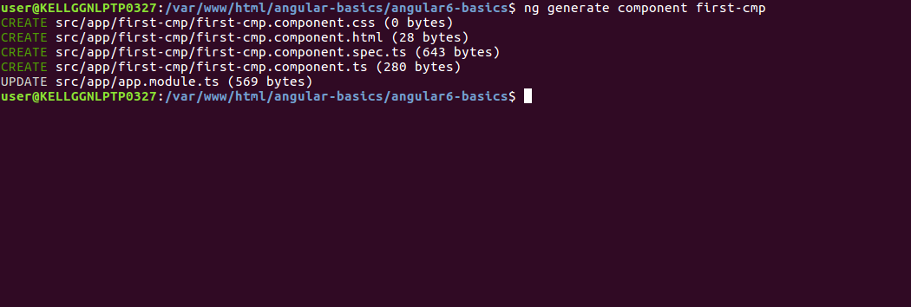
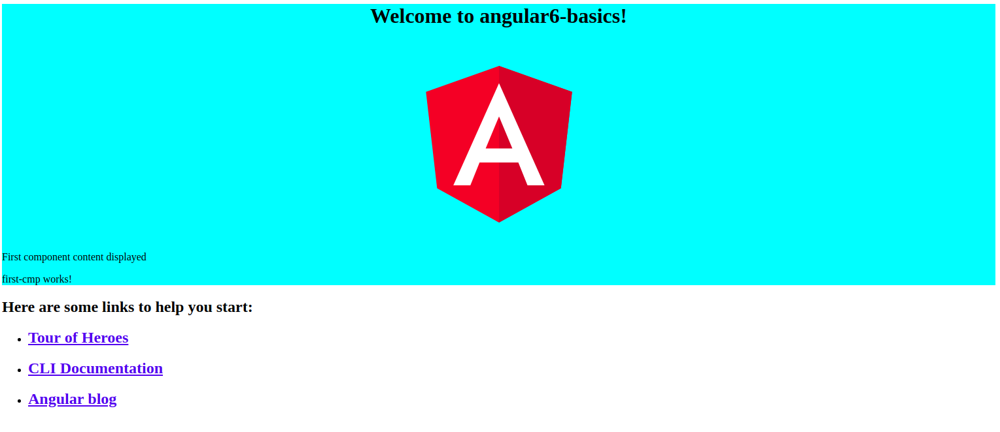

<div>	
  <span><a href ="https://github.com/satish-dev/angular-basics/blob/master/documentation/AngularStructure.md" >Previous (Angular Structure)</a></span>
	&nbsp;&nbsp;&nbsp;&nbsp;&nbsp;&nbsp;&nbsp;&nbsp;&nbsp;&nbsp;&nbsp;&nbsp;&nbsp;
	&nbsp;&nbsp;&nbsp;&nbsp;&nbsp;&nbsp;&nbsp;&nbsp;&nbsp;&nbsp;&nbsp;&nbsp;&nbsp;
	&nbsp;&nbsp;&nbsp;&nbsp;&nbsp;&nbsp;&nbsp;&nbsp;&nbsp;&nbsp;&nbsp;&nbsp;&nbsp;
	&nbsp;&nbsp;&nbsp;&nbsp;&nbsp;&nbsp;&nbsp;&nbsp;&nbsp;&nbsp;&nbsp;&nbsp;&nbsp;
    &nbsp;&nbsp;&nbsp;&nbsp;&nbsp;&nbsp;&nbsp;&nbsp;&nbsp;&nbsp;&nbsp;&nbsp;&nbsp;
	&nbsp;&nbsp;&nbsp;&nbsp;&nbsp;&nbsp;&nbsp;&nbsp;&nbsp;&nbsp;&nbsp;&nbsp;&nbsp;
	&nbsp;&nbsp;&nbsp;&nbsp;&nbsp;&nbsp;&nbsp;&nbsp;&nbsp;&nbsp;&nbsp;&nbsp;&nbsp;
	&nbsp;&nbsp;
	<span><a href ="https://github.com/satish-dev/angular-basics/blob/master/documentation/Module.md" >Next (Angular Module)</a> </span>
</div>
# Angular 6 - Components
Major part of the developement with Angular 6 is done in the components.
It basically classes that interact with the .html file of the component on the browser.
Component has the following file structure :-
* app.component.css
* app.component.html
* app.component.spec.ts
* app.component.ts
* app.module.ts
All the above files were created when we created new angular project.
# Creating your component
Angular cli has a command to create your own component. Besides, the app component which is created while creating the project will always remain the parent and the created component will be the child components.
Run the below command to create a component
```
ng generate component first-cmp
```
After executing the above command you will see the following output.

Now if you will go and check the file structure, you will see the first-cmp new folder created the *src/app* folder
Following files are created under the first-cmp folder-
* first-cmp.component.css - css file for the new component is created.
* first-cmp.component.html - html file is created.
* first-cmp.component.spec.ts - this usally uses for unit testing.
* first-cmp.component.ts - here, we can define the module, properites etc.
Following are the changes in *app.module.ts* after creating the new component
```
import { BrowserModule } from '@angular/platform-browser';
import { NgModule } from '@angular/core';

import { AppRoutingModule } from './app-routing.module';
import { AppComponent } from './app.component';
import { FirstCmpComponent } from './first-cmp/first-cmp.component'; // Includes the first component that we have created

@NgModule({
  declarations: [
    AppComponent,
    FirstCmpComponent  // here it is added in declarations and that will behave as a child component
  ],
  imports: [
    BrowserModule,
    AppRoutingModule
  ],
  providers: [],
  bootstrap: [AppComponent]
})
export class AppModule { }
```
Now let's see the first-cmp.component.ts file content -
```
import { Component, OnInit } from '@angular/core';

@Component({
  selector: 'app-first-cmp',
  templateUrl: './first-cmp.component.html',
  styleUrls: ['./first-cmp.component.css']
})
export class FirstCmpComponent implements OnInit {

  constructor() { }

  ngOnInit() {
  }

}
```
If you see the content of first-cmp.component.ts file, it create a new class named with *FirstCmpComponent*, which implements OnInIt. In this file we also have constructor and method called ngOnInit(). 
*ngOnInit()* is callled by default when the class is executed.
Let us check how the flow works. Now, the app component, which is created by default becomes the parent component. Any component added later will becomes the child component.
# Execution hierarchy of Angular
When we hit the url **http:://localhost:4205/** in the browser, it first executes the *index.html* file which is shown below -
```
<!doctype html>
<html lang="en">
<head>
  <meta charset="utf-8">
  <title>Angular6Basics</title>
  <base href="/">

  <meta name="viewport" content="width=device-width, initial-scale=1">
  <link rel="icon" type="image/x-icon" href="favicon.ico">
</head>
<body>
  <app-root></app-root>
</body>
</html>
```
The above code is similar like to any other html code. But here we have a special tag in the body section 
```
<app-root></app-root>
``` 
The above tag created by the Angular by default. Then this tag has used as an reference in the main.ts file.
Let's see the content of main.ts
```
import { enableProdMode } from '@angular/core';
import { platformBrowserDynamic } from '@angular/platform-browser-dynamic';

import { AppModule } from './app/app.module';
import { environment } from './environments/environment';

if (environment.production) {
  enableProdMode();
}

platformBrowserDynamic().bootstrapModule(AppModule)
  .catch(err => console.error(err));
```
In above file the *AppModule* is imported from the app of the main parent module, and the same time it is given to the bootstrap Module, which makes the appmodule load.
Let's have a look on app.module.ts file -
```
import { BrowserModule } from '@angular/platform-browser';
import { NgModule } from '@angular/core';

import { AppRoutingModule } from './app-routing.module';
import { AppComponent } from './app.component';
import { FirstCmpComponent } from './first-cmp/first-cmp.component';

@NgModule({
  declarations: [
    AppComponent,
    FirstCmpComponent
  ],
  imports: [
    BrowserModule,
    AppRoutingModule
  ],
  providers: [],
  bootstrap: [AppComponent]
})
export class AppModule { }
```
In the above file, the AppComponent is the name given, i.e the variable to store the reference of the app.component.ts and the same is given to the bootstrap. 
Now for better understanding just move on to the app.component.ts file
```
import { Component } from '@angular/core';

@Component({
  selector: 'app-root',
  templateUrl: './app.component.html',
  styleUrls: ['./app.component.css']
})
export class AppComponent {
  title = 'angular6-basics';
}
```
In the above file *@angular/core* is imported and referred as the Component and the same is used in the *Declarator* as -
```
@Component({
  selector: 'app-root',
  templateUrl: './app.component.html',
  styleUrls: ['./app.component.css']
})
```
In the above declarator reference to the selector, templateUrl and styleUrls are given. The selector here is nothing but the tag which is placed in the index.html file that we saw above.
The class AppComponent has a variable called title, which is dispalyed in the browser
The above @Component declarator uses the templateUrl called app.component.html which is as follows- 
```
<!--The content below is only a placeholder and can be replaced.-->
<div style = "text-align:center">
   <h1>
      Welcome to {{title}}.
   </h1>
</div>
```
Just look the above code here we have a variable *title* in curly brackets. It gets replaced with the value, which is defined in the *app.component.ts* file. This is called *binding*. 
We have created a component called first-cmp. The same gets included in the app.module.ts file.
app.module.ts has a reference to the first component created.
Let us have a look of the content of first-cmp
# first.cmp.component.ts
```
import { Component, OnInit } from '@angular/core';

@Component({
  selector: 'app-first-cmp',
  templateUrl: './first-cmp.component.html',
  styleUrls: ['./first-cmp.component.css']
})
export class FirstCmpComponent implements OnInit {

  constructor() { }

  ngOnInit() {
  }

}
```
In the above file we have to import the core too. The reference of the component is used in the declartor.
The declarator has the selector called *app-first-cmp* and the *templateUrl* and *styleUrl*.
Let's have a look of *first-cmp.component.html* file-
```
<p>
  first-cmp works!
</p>
```
If you see the above file, we have just an simple html code with *<p>* tag.
Style file is empty as we do not need any styling at present.
Now let's do something so that we can see the content of newly created component.
For this the *selector app-first-cmp needs to be added in the app.component.html* file just like the below example - 
```
<!--The content below is only a placeholder and can be replaced.-->
<div style = "text-align:center">
   <h1>
      Welcome to {{title}}.
   </h1>
</div>
<app-first-cmp></app-first-cmp>
```
When the *<app-first-cmp></app-first-cmp>* tag is added, then all that is present in .html file of first component, will get displayed on the browser along with the parent component data.
Let us see the first component .html file and the *fist-cmp.component.ts* file.
```
import { Component, OnInit } from '@angular/core';

@Component({
  selector: 'app-first-cmp',
  templateUrl: './first-cmp.component.html',
  styleUrls: ['./first-cmp.component.css']
})
export class FirstCmpComponent implements OnInit {
  firstcomponent = "First component content displayed"; // new variable added
  constructor() { }

  ngOnInit() {
  }

}
```
In the above class we have added a variable firstcomponent and using that variable in *first-cmp.component.html* like the below code-
```
<p>
  {{firstcomponent}}
</p>
<p>
  first-cmp works!
</p>
```
As we have seen that we have included the *<app-first-cmp></app-first-cmp>* selector in the *app.component.html* which is the .html of the parent component, the content present in the first in first-cmp.component.html file gets displayed on the browser as follows-

**Just like the above process we can create components and link the same using the selector in the app-component.html file as per our requirements.**
<div>	
  <span><a href ="https://github.com/satish-dev/angular-basics/blob/master/documentation/AngularStructure.md" >Previous (Angular Structure)</a></span>
	&nbsp;&nbsp;&nbsp;&nbsp;&nbsp;&nbsp;&nbsp;&nbsp;&nbsp;&nbsp;&nbsp;&nbsp;&nbsp;
	&nbsp;&nbsp;&nbsp;&nbsp;&nbsp;&nbsp;&nbsp;&nbsp;&nbsp;&nbsp;&nbsp;&nbsp;&nbsp;
	&nbsp;&nbsp;&nbsp;&nbsp;&nbsp;&nbsp;&nbsp;&nbsp;&nbsp;&nbsp;&nbsp;&nbsp;&nbsp;
	&nbsp;&nbsp;&nbsp;&nbsp;&nbsp;&nbsp;&nbsp;&nbsp;&nbsp;&nbsp;&nbsp;&nbsp;&nbsp;
    &nbsp;&nbsp;&nbsp;&nbsp;&nbsp;&nbsp;&nbsp;&nbsp;&nbsp;&nbsp;&nbsp;&nbsp;&nbsp;
	&nbsp;&nbsp;&nbsp;&nbsp;&nbsp;&nbsp;&nbsp;&nbsp;&nbsp;&nbsp;&nbsp;&nbsp;&nbsp;
	&nbsp;&nbsp;&nbsp;&nbsp;&nbsp;&nbsp;&nbsp;&nbsp;&nbsp;&nbsp;&nbsp;&nbsp;&nbsp;
	&nbsp;&nbsp;
	<span><a href ="https://github.com/satish-dev/angular-basics/blob/master/documentation/Module.md" >Next (Angular Module)</a> </span>
</div>
