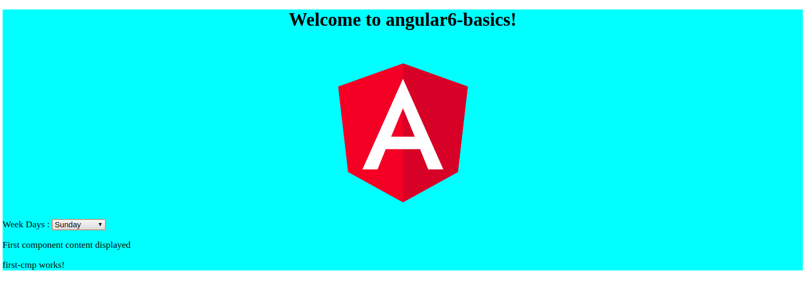
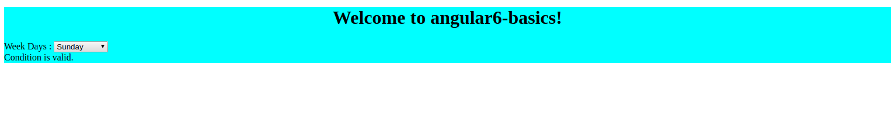
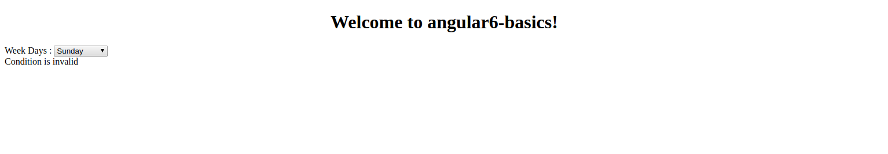

<div>	
  <span><a href ="https://github.com/satish-dev/angular-basics/blob/master/documentation/Module.md" >Previous (Angular Module)</a></span>
	&nbsp;&nbsp;&nbsp;&nbsp;&nbsp;&nbsp;&nbsp;&nbsp;&nbsp;&nbsp;&nbsp;&nbsp;&nbsp;
	&nbsp;&nbsp;&nbsp;&nbsp;&nbsp;&nbsp;&nbsp;&nbsp;&nbsp;&nbsp;&nbsp;&nbsp;&nbsp;
	&nbsp;&nbsp;&nbsp;&nbsp;&nbsp;&nbsp;&nbsp;&nbsp;&nbsp;&nbsp;&nbsp;&nbsp;&nbsp;
	&nbsp;&nbsp;&nbsp;&nbsp;&nbsp;&nbsp;&nbsp;&nbsp;&nbsp;&nbsp;&nbsp;&nbsp;&nbsp;
    &nbsp;&nbsp;&nbsp;&nbsp;&nbsp;&nbsp;&nbsp;&nbsp;&nbsp;&nbsp;&nbsp;&nbsp;&nbsp;
	&nbsp;&nbsp;&nbsp;&nbsp;&nbsp;&nbsp;&nbsp;&nbsp;&nbsp;&nbsp;&nbsp;&nbsp;&nbsp;
	&nbsp;&nbsp;&nbsp;&nbsp;&nbsp;&nbsp;&nbsp;&nbsp;&nbsp;&nbsp;&nbsp;&nbsp;&nbsp;
	&nbsp;&nbsp;
	<span><a href ="https://github.com/satish-dev/angular-basics/blob/master/documentation/EventBinding.md" >Next (Event Binding)</a> </span>
</div>
# Angular 6 Data Binding
In Angular Data Binding is available from *AngularJS*, *Angular 2,4* and it is still available in *Angular 6*. For data binding we uses the *curly brackes* - {{}} , This process of binding data is called the **interpolation**.
**Example**:- There was an example in which we have declared the variable *title* in *app.component.ts* file and in *app.component.html* file we were refering the variable as {{title}}.
Let us understand it with example in which we create a *dropdown of week days*. To implement this we have to create an array of weeks days in *app.component.ts* as follows -
```
import { Component } from '@angular/core';
@Component({
   selector: 'app-root',
   templateUrl: './app.component.html',
   styleUrls: ['./app.component.css']
})
export class AppComponent {
   title = 'Angular 6 Project!';
   // declared array of weeks.
   weekDays = ["Sunday", "Monday", "Tuesday", "Wednesday",
            "Thrusday", "Friday", "Saturday"];
}
```
We have declared the week array above, now its time to display that on the browser. Fot this, we will use the following line of code -
```
<!--The content below is only a placeholder and can be replaced. -->
<div style = "text-align:center">
   <h1>
      Welcome to {{title}}.
   </h1>
</div>
<div> Week Days :
   <select>
      <option *ngFor = "let i of weekDays">{{i}}</option>
   </select>
</div>
```
In the above example we have iterate the for loop over the week days array, which creating the option tag with the value present in week days array.
For loop syntax in Angular is *ngFor = "let I of months" and to get the value of weeks days we are displaying it in {{i}}.
Here we can see the two curly brackets help with data binding. We can declare the variable in our *app.component.ts* file and the same will be replaced using the curly brackets.
Below will be the output of above example

Now let see display data in the browser on the based of condition.In the below example in **app.component.ts** we will add a variable and with the value of *true*. By the help of if statement, we will hide/show the content on the browser.
```
import { Component } from '@angular/core';

@Component({
  selector: 'app-root',
  templateUrl: './app.component.html',
  styleUrls: ['./app.component.css']
})
export class AppComponent {
  title = 'angular6-basics';
  // declared array of weeks
  weekDays = ["Sunday", "Monday", "Tuesday", "Wednesday",
  "Thrusday", "Friday", "Saturday"];
  validationStatus = true; // Here the variable is set to true
}
```
Now lets change the content of **app.component.html** to dispaly the content on the based of the condition.
```
<!--The content below is only a placeholder and can be replaced.-->
<div class="divcolor">
  <div style="text-align:center">
    <h1>
      Welcome to {{ title }}!
    </h1>
  </div>
  <div> Week Days :
    <select>
      <option *ngFor="let i of weekDays">{{i}}</option>
    </select>
  </div>
  <span *ngIf = "validationStatus">Condition is valid.</span>
  <app-first-cmp></app-first-cmp>
</div>
<router-outlet></router-outlet>
```
Below will be the output of above example

Now let's try the this example using the IF THEN ELSE condition.
Now we will have to set the variable as follow in *app.component.ts* file :- 
```
validationStatus = false; // Here the variable is set to true
```
In the above intialization, we have made the *validationStatus* variable as false. To print the else condition, we will have to create the ng-template as follows -
```
<ng-template #condition1>Condition is invalid</ng-template>
```
The whole changed code will we look like this:- 
```
<span *ngIf = "validationStatus; else condition1">Condition is valid.</span>
<ng-template #condition1>Condition is invalid</ng-template>
```
Let's understand the above, If you used the else condition and the variable used is condition1. The same is assigned as an id to the ng-template, and when the available variable is set to the false the text *Condition is invalid* will display.
Below will be the output of above example

<div>	
  <span><a href ="https://github.com/satish-dev/angular-basics/blob/master/documentation/Module.md" >Previous (Angular Module)</a></span>
	&nbsp;&nbsp;&nbsp;&nbsp;&nbsp;&nbsp;&nbsp;&nbsp;&nbsp;&nbsp;&nbsp;&nbsp;&nbsp;
	&nbsp;&nbsp;&nbsp;&nbsp;&nbsp;&nbsp;&nbsp;&nbsp;&nbsp;&nbsp;&nbsp;&nbsp;&nbsp;
	&nbsp;&nbsp;&nbsp;&nbsp;&nbsp;&nbsp;&nbsp;&nbsp;&nbsp;&nbsp;&nbsp;&nbsp;&nbsp;
	&nbsp;&nbsp;&nbsp;&nbsp;&nbsp;&nbsp;&nbsp;&nbsp;&nbsp;&nbsp;&nbsp;&nbsp;&nbsp;
    &nbsp;&nbsp;&nbsp;&nbsp;&nbsp;&nbsp;&nbsp;&nbsp;&nbsp;&nbsp;&nbsp;&nbsp;&nbsp;
	&nbsp;&nbsp;&nbsp;&nbsp;&nbsp;&nbsp;&nbsp;&nbsp;&nbsp;&nbsp;&nbsp;&nbsp;&nbsp;
	&nbsp;&nbsp;&nbsp;&nbsp;&nbsp;&nbsp;&nbsp;&nbsp;&nbsp;&nbsp;&nbsp;&nbsp;&nbsp;
	&nbsp;&nbsp;
	<span><a href ="https://github.com/satish-dev/angular-basics/blob/master/documentation/EventBinding.md" >Next (Event Binding)</a> </span>
</div>
