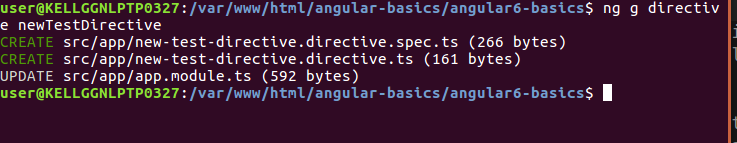
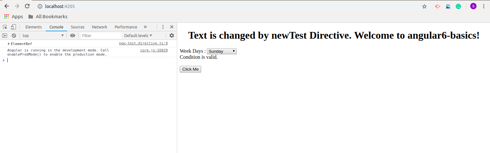

# Angular 6 Directives
It is a *JS* class , which is declared as @directives. We have three directives in Angular which are given below :- 
* **Component Directives**
This will have the details of how the component should be processed, instantiated and used at runtime.
* **Structural Directives**
A structure directive basically deals with manipulating the dom elements. Structural directives have a * sign before it. *For example:- *ngIF, ngFor*
* **Attribute Directives**
It deal with changing the look and behavior of the dom element.
## Creating Custom Directives
We can also create our own directives and these are created by us, so there is no predefined standard for them.The command to create directive using the command line is -
```
ng g directive nameofthedirective
e.g
ng g directive newTestDirective
```
You just have to execute the above command to create the directive in angular.Similar to the below image you will see the output on your screen.

If you will see the above image you will see *new-test-directive.directive.spec.ts* and *new-test-directive.directive.ts* files gets created and *app.module.ts* gets updated.
Below will be the updated code of *app.module.ts* file
```
import { BrowserModule } from '@angular/platform-browser';
import { NgModule } from '@angular/core';

import { AppRoutingModule } from './app-routing.module';
import { AppComponent } from './app.component';
import { FirstCmpComponent } from './first-cmp/first-cmp.component';
import { NewTestDirective } from './new-test.directive';

@NgModule({
  declarations: [
    AppComponent,
    FirstCmpComponent,
    NewTestDirective // Inclued the new test directive
  ],
  imports: [
    BrowserModule,
    AppRoutingModule
  ],
  providers: [],
  bootstrap: [AppComponent]
})
export class AppModule { }
```
If you look the above code you will see *NewTestDirective* class is included in the *declarations* section.And same class is also imported from the file *new-test.directive.ts*, which is given below -  
```
import { Directive } from '@angular/core';

@Directive({
  selector: '[appNewTest]'
})
export class NewTestDirective {

  constructor() { }

}
```
If you will see the above file has a directive and it also have a selector property. Whatever we are defining the selector the same has to match in the view, where we will use the custom directive. Now in the *app.component.html* view, let us add the directive as follows - 
```
<div style = "text-align:center">
   <span appNewTest>Welcome to {{title}}.</span>
</div>
```
Now we have write the changes in *new-test.directive.ts* just like the below code :- 
```
import { Directive, ElementRef } from '@angular/core';

@Directive({
  selector: '[appNewTest]'
})
export class NewTestDirective {

  constructor(Element: ElementRef) {
    console.log(Element);
    Element.nativeElement.innerText = "Text is changed by newTest Directive.";
  }

}
```
In above code there is class called *NewTestDirective* and a *constructor*, which takes the element of type ElementRef, *which is mandatory*. The element has all the details to which the the *New test directive has to applied*
Let's have a look content on the browser :-

<div>	
  <span><a href ="https://github.com/satish-dev/angular-basics/blob/master/documentation/Template.md" >Previous (Angular Template)</a></span>
	&nbsp;&nbsp;&nbsp;&nbsp;&nbsp;&nbsp;&nbsp;&nbsp;&nbsp;&nbsp;&nbsp;&nbsp;&nbsp;
	&nbsp;&nbsp;&nbsp;&nbsp;&nbsp;&nbsp;&nbsp;&nbsp;&nbsp;&nbsp;&nbsp;&nbsp;&nbsp;
	&nbsp;&nbsp;&nbsp;&nbsp;&nbsp;&nbsp;&nbsp;&nbsp;&nbsp;&nbsp;&nbsp;&nbsp;&nbsp;
	&nbsp;&nbsp;&nbsp;&nbsp;&nbsp;&nbsp;&nbsp;&nbsp;&nbsp;&nbsp;&nbsp;&nbsp;&nbsp;
    &nbsp;&nbsp;&nbsp;&nbsp;&nbsp;&nbsp;&nbsp;&nbsp;&nbsp;&nbsp;&nbsp;&nbsp;&nbsp;
	&nbsp;&nbsp;&nbsp;&nbsp;&nbsp;&nbsp;&nbsp;&nbsp;&nbsp;&nbsp;&nbsp;&nbsp;&nbsp;
	&nbsp;&nbsp;&nbsp;&nbsp;&nbsp;&nbsp;&nbsp;&nbsp;&nbsp;&nbsp;&nbsp;&nbsp;&nbsp;
	&nbsp;&nbsp;
	<span><a href ="https://github.com/satish-dev/angular-basics/blob/master/documentation/Pipes.md" >Next (Data Pipes)</a> </span>
</div>