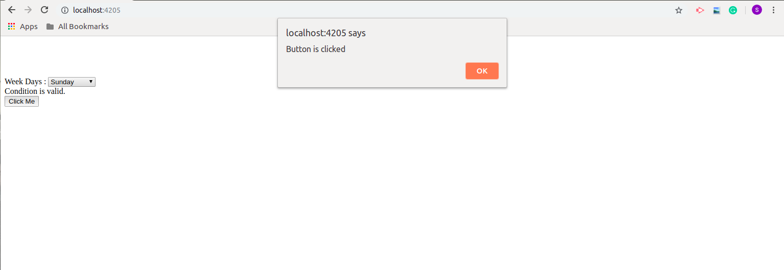
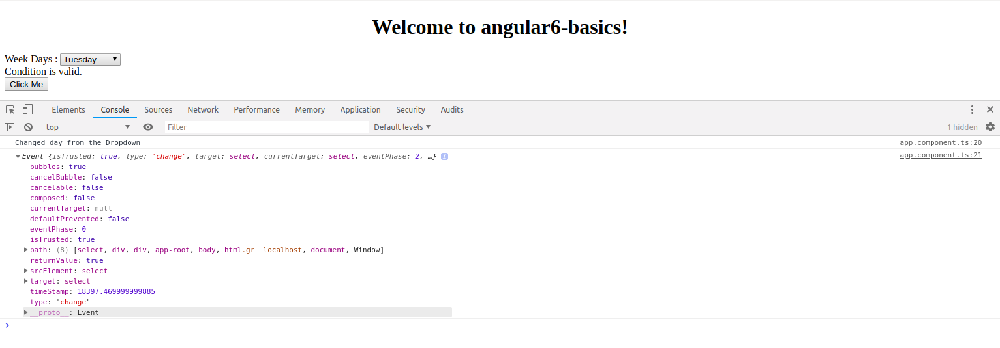

# Angular 6 Event Binding
Whenever a user interacts with the application by keyboard movement, mouse click, or a mouseover that will generate an *event*. These events need to be handled to perform some kind of action. 
*Binding these types of events to any process is called the Event handling*
Let just understand it with the help of example:- In your app.component.html create a button just like the below example
```
<button (click)="buttonClickFunction($event)">
   Click Me
</button>
```
In the above example we are calling a function *buttonClickFunction*, Now the time is to define that function in your *app.component.ts* file just like the below example
```
    buttonClickFunction(event) { 
        //just added console.log which will display the event details in browser on click of the button.
        alert("Button is clicked");
        console.log(event);
    }
```
Whenever you click to the button, The control will come to the function *buttonClickFunction* that was defined in *app.component.ts* file . In function we have a statement that will display that button was clicked just like the below image.

Let's now add the change event on the *weekDays* dropdown that we have created in *app.component.html*.
```
<select (change) = "changeWeekDays($event)"> // Here we have added the change event to call the changeWeekDays function
    <option *ngFor="let i of weekDays">{{i}}</option>
</select>
```
Now add the *changeWeekDays* method in *app.component.ts* file just like the below example
```
  changeWeeks(event) {
    console.log("Changed day from the Dropdown");
    console.log(event);
  }
```
You will see if you are changing the dropdown value the console will have **Changed day from the Dropdown** just like the below image.

<div>	
  <span><a href ="https://github.com/satish-dev/angular-basics/blob/master/documentation/DataBinding.md" >Previous (Data Binding)</a></span>
	&nbsp;&nbsp;&nbsp;&nbsp;&nbsp;&nbsp;&nbsp;&nbsp;&nbsp;&nbsp;&nbsp;&nbsp;&nbsp;
	&nbsp;&nbsp;&nbsp;&nbsp;&nbsp;&nbsp;&nbsp;&nbsp;&nbsp;&nbsp;&nbsp;&nbsp;&nbsp;
	&nbsp;&nbsp;&nbsp;&nbsp;&nbsp;&nbsp;&nbsp;&nbsp;&nbsp;&nbsp;&nbsp;&nbsp;&nbsp;
	&nbsp;&nbsp;&nbsp;&nbsp;&nbsp;&nbsp;&nbsp;&nbsp;&nbsp;&nbsp;&nbsp;&nbsp;&nbsp;
    &nbsp;&nbsp;&nbsp;&nbsp;&nbsp;&nbsp;&nbsp;&nbsp;&nbsp;&nbsp;&nbsp;&nbsp;&nbsp;
	&nbsp;&nbsp;&nbsp;&nbsp;&nbsp;&nbsp;&nbsp;&nbsp;&nbsp;&nbsp;&nbsp;&nbsp;&nbsp;
	&nbsp;&nbsp;&nbsp;&nbsp;&nbsp;&nbsp;&nbsp;&nbsp;&nbsp;&nbsp;&nbsp;&nbsp;&nbsp;
	&nbsp;&nbsp;
	<span><a href ="https://github.com/satish-dev/angular-basics/blob/master/documentation/Template.md" >Next (Angular Template</a> </span>
</div>