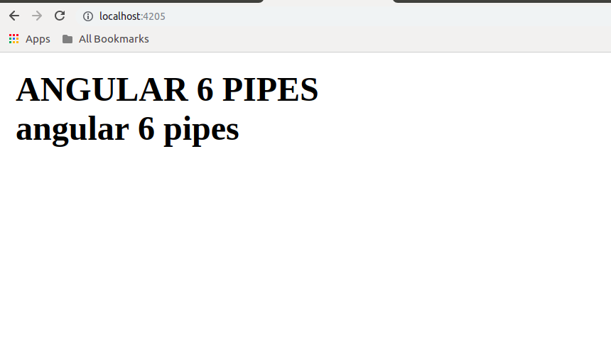

# Angular 6 Pipes
In *Angular 1* we were used calling the *pipes* as *filter* and from *Angular 2* onwards we started calling it as pipes.
The **|** character is used to transform data. Following is the syntax for the same
```
{{Welcome to Angular 6 | upercase}}
```
It takes integers, strings, arrays, and date as input seprated with | to be converted in the format as required and display the same in the browser.
Let's understand it with the example.
We will just add and title variable in *app.component.ts* file then we will use that variable from *app.component.html* file just like the below examples:-
Updated content of *app.component.ts* file is given below
```
import { Component } from '@angular/core';
@Component({
  selector: 'app-root',
  templateUrl: './app.component.html',
  styleUrls: ['./app.component.css']
})
export class AppComponent {
  title = 'Angular 6 Pipes';
}
```
Updated content of *app.component.html* file
```
<b>{{title | uppercase}}</b><br/>
<b>{{title | lowercase}}</b>
```
After completing the above changes you will see the following output on your screen:-
