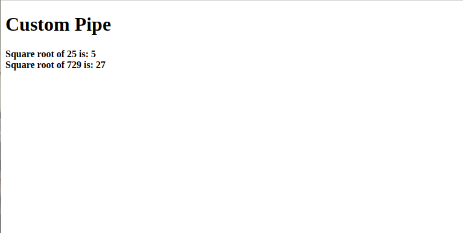

# Angular 6 Pipes
In *Angular 1* we were used calling the *pipes* as *filter* and from *Angular 2* onwards we started calling it as pipes.
The **|** character is used to transform data. Following is the syntax for the same
```
{{Welcome to Angular 6 | upercase}}
```
It takes integers, strings, arrays, and date as input seprated with | to be converted in the format as required and display the same in the browser.
Let's understand it with the example.
We will just add and title variable in *app.component.ts* file then we will use that variable from *app.component.html* file just like the below examples:-
Updated content of *app.component.ts* file is given below
```
import { Component } from '@angular/core';
@Component({
  selector: 'app-root',
  templateUrl: './app.component.html',
  styleUrls: ['./app.component.css']
})
export class AppComponent {
  title = 'Angular 6 Pipes';
}
```
Updated content of *app.component.html* file
```
<b>{{title | uppercase}}</b><br/>
<b>{{title | lowercase}}</b>
```
After completing the above changes you will see the following output on your screen:-

There are many built-in pipes in Angular-6. The pipes are listed below -
* Lowercasepipe
* Uppercasepipe
* Datepipe
* Currencypipe
* Jsonpipe
* Percentpipe
* Decimalpipe
* Slicepipe
As we already have an example of lowercase and uppercase pipe, Now let's discuss some other pipes.
We just have to add the following required variables in app.component.ts file.
```
import { Component } from '@angular/core';
@Component({
  selector: 'app-root',
  templateUrl: './app.component.html',
  styleUrls: ['./app.component.css']
})
export class AppComponent {
  
  title = 'Angular 6 Project !';
  todaydate = new Date();
  jsonval = {name: 'Ram', age: '50', address : {permenant:'Uttrakhand', temporary: 'Delhi' }};
  weekDays = ["Sunday", "Monday", "Tuesday", "Wednesday", "Thrusday", "Friday", "Saturday"];
}
```
To use the *pipes* we have to do the following line of changes in app.component.html file
```
<div style="width:100%">
  <div style="width:40%;float:left;border:solid 1px blue;">
    <h1>Uppercase Pipe</h1>
    <b> {{title | uppercase}}</b>
    <hr/>
    <h1>Lowercase Pipe</h1>
    <b> {{title | lowercase}}</b>
    <hr/>
    <h1>Currency Pipe</h1>
    <b>{{6589.23 | currency:"USD"}}</b><br/>
    <b>{{6589.23 | currency:"USD":true}}</b> //Boolean true is used to get the sign of the currency.
    <hr/>
    <h1>Date pipe</h1>
    <b>{{todaydate | date:'d/M/y'}}</b><br/>
    <b>{{todaydate | date:'shortTime'}}</b>
    <hr/>
    <h1>Decimal Pipe</h1>
    <b>{{ 454.78787814 | number: '3.4-4' }}</b> // 3 is for main integer, 4 -4 are for integers to be displayed.
  </div>
  <div style = "width:40%;float:left;border:solid 1px black;">
    <h1>Json Pipe</h1>
    <b>{{ jsonval | json }}</b>
    <hr/>
    <h1>Percent Pipe</h1>
    <b>{{00.54565 | percent}}</b>
    <hr/>
    <h1>Slice Pipe</h1>
    <b>{{weekDays | slice:2:6}}</b> 
    // here 2 and 6 refers to the start and the end index
 </div>
</div>
```
After doing the above changes we will have the following output on our screen

We have seen many example for *built-in* pipes, Now it's time create custom pipe.
### Custom pipes
In order to create a custom pipe we need to create a new ts file, let's just create a pipe to sqrt of the number with the following content(app.sqrt.ts).
```
import {Pipe, PipeTransform} from '@angular/core';
@Pipe ({
   name : 'sqrt'
})
export class SqrtPipe implements PipeTransform {
   transform(val : number) : number {
      return Math.sqrt(val);
   }
}
```
In the above code you will see, to create custom pipe you have to import *Pipe* and *PipeTransform* from *Angualr/core*.
In @Pipe directive we have to give the name to our pipe, which will be used in our .html file.
Now we have to create the class *SqrtPipe* and this class will implements the *PipeTransform*. The transform method defined in the class will take argument as the number and will return the number after taking the square root.
Now we have to add this *app.sqrt.ts* file in *app.module.ts* just like the below example -
```
import { BrowserModule } from '@angular/platform-browser';
import { NgModule } from '@angular/core';

import { AppRoutingModule } from './app-routing.module';
import { AppComponent } from './app.component';
import { FirstCmpComponent } from './first-cmp/first-cmp.component';
import { NewTestDirective } from './new-test.directive';
import { SqrtPipe } from './app.sqrt'; // Imported that pipe here
@NgModule({
  declarations: [
    SqrtPipe, // Used that pipe
    AppComponent,
    FirstCmpComponent,
    NewTestDirective
  ],
  imports: [
    BrowserModule,
    AppRoutingModule
  ],
  providers: [],
  bootstrap: [AppComponent]
})
export class AppModule { }
```
To make the above working we have to some changes in app.component.html file
```
<h1>Custom Pipe</h1>
<b>Square root of 25 is: {{25 | sqrt}}</b>
<br/>
<b>Square root of 729 is: {{729 | sqrt}}</b>
```
The output looks as follows −

<div>	
  <span><a href ="https://github.com/satish-dev/angular-basics/blob/master/documentation/Directives.md" >Previous (Directives)</a></span>
	&nbsp;&nbsp;&nbsp;&nbsp;&nbsp;&nbsp;&nbsp;&nbsp;&nbsp;&nbsp;&nbsp;&nbsp;&nbsp;
	&nbsp;&nbsp;&nbsp;&nbsp;&nbsp;&nbsp;&nbsp;&nbsp;&nbsp;&nbsp;&nbsp;&nbsp;&nbsp;
	&nbsp;&nbsp;&nbsp;&nbsp;&nbsp;&nbsp;&nbsp;&nbsp;&nbsp;&nbsp;&nbsp;&nbsp;&nbsp;
	&nbsp;&nbsp;&nbsp;&nbsp;&nbsp;&nbsp;&nbsp;&nbsp;&nbsp;&nbsp;&nbsp;&nbsp;&nbsp;
    &nbsp;&nbsp;&nbsp;&nbsp;&nbsp;&nbsp;&nbsp;&nbsp;&nbsp;&nbsp;&nbsp;&nbsp;&nbsp;
	&nbsp;&nbsp;&nbsp;&nbsp;&nbsp;&nbsp;&nbsp;&nbsp;&nbsp;&nbsp;&nbsp;&nbsp;&nbsp;
	&nbsp;&nbsp;&nbsp;&nbsp;&nbsp;&nbsp;&nbsp;&nbsp;&nbsp;&nbsp;&nbsp;&nbsp;&nbsp;
	&nbsp;&nbsp;
	<span><a href ="https://github.com/satish-dev/angular-basics/blob/master/documentation/Routing.md" >Next (Data Routing)</a> </span>
</div>
