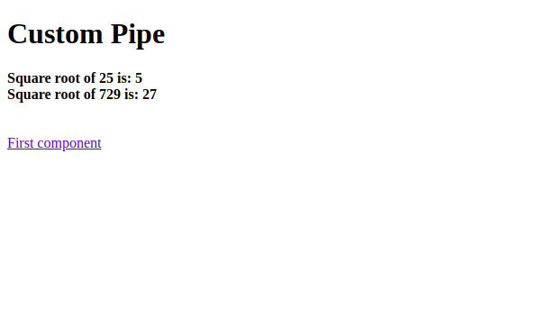
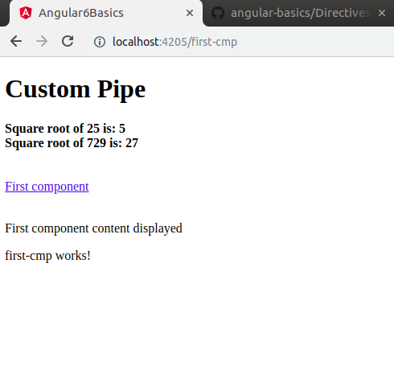

# Angular 6 Routing
Navigating between pages is called the *routing*.Sometimes you have seen many sites with links directs you to a new page.
This can be achieved using routing. Here the pages that we are referring to will be in the form of components as we have already seen how to create a component. Let us now use the same component to understand the routing.
We have to make the following changes in *app.module.ts*
```
import { BrowserModule } from '@angular/platform-browser';
import { NgModule } from '@angular/core';

import { AppRoutingModule } from './app-routing.module';
import { RouterModule} from '@angular/router'; // Included the router module
import { AppComponent } from './app.component';
import { FirstCmpComponent } from './first-cmp/first-cmp.component';
import { NewTestDirective } from './new-test.directive';
import { SqrtPipe } from './app.sqrt';
@NgModule({
  declarations: [
    SqrtPipe,
    AppComponent,
    FirstCmpComponent,
    NewTestDirective
  ],
  imports: [
    BrowserModule,
    AppRoutingModule,
    RouterModule.forRoot([ 
      {
         path: 'first-cmp', // Defining the router module 
         component: FirstCmpComponent
      }
   ])
  ],
  providers: [],
  bootstrap: [AppComponent]
})
export class AppModule { }.
```
### import { RouterModule} from '@angular/router'
In above statement the *RouterModule* is imported from the *angular/router*. The module is included in import as shown below-
```
RouterModule.forRoot([
   {
      path: 'new-cmp',
      component: NewCmpComponent
   }
])
```
*RouterModule* refers to the *forRoot* which takes an input as an array, which in turn has the object of the path and the component. Path is the name of the router and component is the name of the class.
Now we need that the content from the *firt-cmp.component.html* file to be displayed whenever required or clicked from the main module. For this, we need to add the router details in *app.component.html* just like the below the example:-
```
<h1>Custom Pipe</h1>
<b>Square root of 25 is: {{25 | sqrt}}</b><br/>
<b>Square root of 729 is: {{729 | sqrt}}</b>
<br />
<br />
<br />
<a routerLink = "First-cmp">First component</a>
<br />
<br/>
<router-outlet></router-outlet>
```
In above code, we have created the anchor link tag and given *routerLink* as "first-cmp" and that was referred in app.module.ts as the path.
Whenever a user clicks first component, the page should display the content. For this, we need the following tag 
```
<router-outlet></router-outlet>
```
Above tag will ensures that the content in the first-cmp.component.html will be displayed on the page when a user clicks new component.
Before clicking on link the content of the page will be look like the following

After clicking on link the content of the page will be look like the following
<br/>

We noticied now the URL contains http://localhost:4205/first-cmp, in this first-cmp gets appended to the original url, which is the path given in *app.module.ts* and the router link in the *app.component.html*

Whenever a user clicks on *Fist component*, the page is not refreshed and the contnents are shown to the user without any reloading. Only the specified piece of the site code will be reloaded when clicked.
This will help whenever we have heavy content on the page and needs to be loaded based on the user interaction.
*This will also helps user to give good experience as the page is not reloaded*
<div>	
  <span><a href ="https://github.com/satish-dev/angular-basics/blob/master/documentation/Pipes.md" >Previous (Pipes)</a></span>
	&nbsp;&nbsp;&nbsp;&nbsp;&nbsp;&nbsp;&nbsp;&nbsp;&nbsp;&nbsp;&nbsp;&nbsp;&nbsp;
	&nbsp;&nbsp;&nbsp;&nbsp;&nbsp;&nbsp;&nbsp;&nbsp;&nbsp;&nbsp;&nbsp;&nbsp;&nbsp;
	&nbsp;&nbsp;&nbsp;&nbsp;&nbsp;&nbsp;&nbsp;&nbsp;&nbsp;&nbsp;&nbsp;&nbsp;&nbsp;
	&nbsp;&nbsp;&nbsp;&nbsp;&nbsp;&nbsp;&nbsp;&nbsp;&nbsp;&nbsp;&nbsp;&nbsp;&nbsp;
    &nbsp;&nbsp;&nbsp;&nbsp;&nbsp;&nbsp;&nbsp;&nbsp;&nbsp;&nbsp;&nbsp;&nbsp;&nbsp;
	&nbsp;&nbsp;&nbsp;&nbsp;&nbsp;&nbsp;&nbsp;&nbsp;&nbsp;&nbsp;&nbsp;&nbsp;&nbsp;
	&nbsp;&nbsp;&nbsp;&nbsp;&nbsp;&nbsp;&nbsp;&nbsp;&nbsp;&nbsp;&nbsp;&nbsp;&nbsp;
	&nbsp;&nbsp;
	<span><a href ="https://github.com/satish-dev/angular-basics/blob/master/documentation/Services.md" >Next (Services)</a> </span>
</div>

