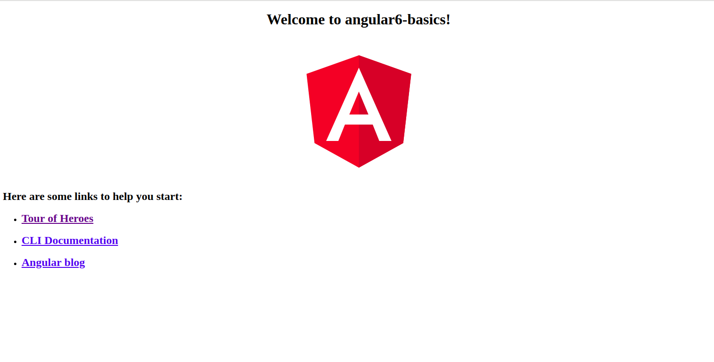

# Runnig project
We have discussed about the installaton of project now it is the time to running the project.
### Compling the project
In installtion section we have created a Angular 6 project.
Now we have the file structure for our project, let us compile our project with the following command −
<br/>
```
var/www/html/angular-basics$ ng serve 
```
The ng serve command builds the application and starts the web server.
The web server starts on port 4200. Type the url http://localhost:4200/ in the browser and see the output. You will be directed to the following screen −

You have noticed we have used *ng serve* command to build the application, If you have noticed by default it is using the 4200 port, which  is the default port that angular-cli makes use of while compling.You can change the port if you wish using the follwoing command -
```
ng serve --host 0.0.0.0 --port 4205
```
Where --port parameter defining the port number that to be used and --host for defining the host.
### If a port has already in use 
If you find the error that 4200 is already in use in that case first of all you need to kill the port by using the below command then serve it again.
```
fuser -k 4200/tcp 
```
<div>
	<span><a href ="https://github.com/satish-dev/angular-basics/blob/master/documentation/Installation.md" >Previous (Installation)</a></span>
	&nbsp;&nbsp;&nbsp;&nbsp;&nbsp;&nbsp;&nbsp;&nbsp;&nbsp;&nbsp;&nbsp;&nbsp;&nbsp;
	&nbsp;&nbsp;&nbsp;&nbsp;&nbsp;&nbsp;&nbsp;&nbsp;&nbsp;&nbsp;&nbsp;&nbsp;&nbsp;
	&nbsp;&nbsp;&nbsp;&nbsp;&nbsp;&nbsp;&nbsp;&nbsp;&nbsp;&nbsp;&nbsp;&nbsp;&nbsp;
	&nbsp;&nbsp;&nbsp;&nbsp;&nbsp;&nbsp;&nbsp;&nbsp;&nbsp;&nbsp;&nbsp;&nbsp;&nbsp;
    &nbsp;&nbsp;&nbsp;&nbsp;&nbsp;&nbsp;&nbsp;&nbsp;&nbsp;&nbsp;&nbsp;&nbsp;&nbsp;
	&nbsp;&nbsp;&nbsp;&nbsp;&nbsp;&nbsp;&nbsp;&nbsp;&nbsp;&nbsp;&nbsp;&nbsp;&nbsp;
	&nbsp;&nbsp;&nbsp;&nbsp;&nbsp;&nbsp;&nbsp;&nbsp;&nbsp;&nbsp;&nbsp;&nbsp;&nbsp;
	&nbsp;&nbsp;&nbsp;&nbsp;&nbsp;&nbsp;&nbsp;&nbsp;&nbsp;&nbsp;&nbsp;&nbsp;&nbsp;
	<span><a href ="https://github.com/satish-dev/angular-basics/blob/master/documentation/AngularStructure.md" >Next (Angular structure)</a> </span>
</div>