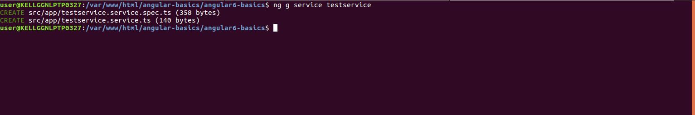
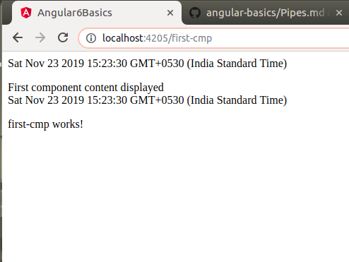

# Angular 6 Services
Sometimes we have a situation to access the some part of the code throughout the application, it can be for data connection that needs to be shared across components, etc.
With the help of *Services* we can accesss methods and properties across other components in the entire project.
### Creating the Service
To create the service use the below command in your terminal
```
ng g service yourservicename
```
Below will be the output once we execute the above command

The files are created in the app folder as follows −
* *testservice.service.spec.ts*
* *testservice.service.ts*
Let see the content of *testservice.service.ts* file 
```
import { Injectable } from '@angular/core';

@Injectable({
  providedIn: 'root'
})
export class TestserviceService {

  constructor() { }
}
```
If you see the code, *Injectable* module is imported from the @angular/core. It contains the @Injectable method and a class called TestserviceService, We can create our service function in this class.
In order to implement this service, we have to include this service in the main parent *app.module.ts* just like the following :- 
```
import { BrowserModule } from '@angular/platform-browser';
import { NgModule } from '@angular/core';
import { AppRoutingModule } from './app-routing.module';
import { RouterModule} from '@angular/router';
import { AppComponent } from './app.component';
import { TestserviceService } from './testservice.service';
import { FirstCmpComponent } from './first-cmp/first-cmp.component';
import { NewTestDirective } from './new-test.directive';
import { SqrtPipe } from './app.sqrt';
@NgModule({
  declarations: [
    SqrtPipe,
    AppComponent,
    FirstCmpComponent,
    NewTestDirective
  ],
  imports: [
    BrowserModule,
    AppRoutingModule,
    RouterModule.forRoot([
      {
         path: 'first-cmp',
         component: FirstCmpComponent
      }
   ])
  ],
  providers: [TestserviceService],
  bootstrap: [AppComponent]
})
export class AppModule { }
```
In the above code we have imported the service with the class name(*TestserviceService*) and same class is used in the providers.
### Example
Now in service class we will create a function which will display today's date that can be used in the main parent component *app.component.ts* and also in the new component *first-cmp.component.ts*.
We just have to do the following changes in *testservice.service.ts* file
```
import {Injectable} from '@angular/core';
@Injectable({
    provideIn: 'root'
});
export class TestserviceService {
    constructor() { }
    displayTodayDate() {
        let ndate = new Date();
        return ndate;
    }
}
```
In the above code we have created a function *displayDate()* and in that we are returning the new Date().
Now let see how we can access this function in the component clas*app.component.ts*.
```
import { Component } from '@angular/core';
import { TestserviceService } from './testservice.service'; // Imported the created service

@Component({
  selector: 'app-root',
  templateUrl: './app.component.html',
  styleUrls: ['./app.component.css']
})

export class AppComponent {
  title = 'Angular 6 Project !';
  todaydate : Date;
  constructor(private myservice: TestserviceService) {}
  ngOnInit() {
    this.todaydate = this.myservice.displayTodayDate();
  }
}
```
In above code *ngOnIt* function gets called by default in any component created. We have first imports the *created service* then called it's function to get the date value.
To make the above code working we have to insert the following code in *app.component.html* file just like the below 
```
{{todaydate}}
<app-first-cmp></app-first-cmp>
```
Now, Let us see how we can use the same service in *first-cmp.component.ts* file. We just have to do the following changes in this file 
```
import { Component, OnInit } from '@angular/core';
import {TestserviceService} from '../testservice.service'; // Imports the test service
@Component({
  selector: 'app-first-cmp',
  templateUrl: './first-cmp.component.html',
  styleUrls: ['./first-cmp.component.css']
})
export class FirstCmpComponent implements OnInit {
  firstcomponent = "First component content displayed";
  todaydate: Date;
  constructor(private testservice: TestserviceService) { }
  ngOnInit() {
    this.todaydate = this.testservice.displayTodayDate();
  }

}
```
After doing the changes we also have to make some change in *first-cmp.component.html* file
```
<p>
  {{firstcomponent}}
<br/>
  {{todaydate}}
</p>
<p>
  first-cmp works!
</p>
```
After doing the above changes you will see the following content on your browser.
<br/>

<br/>
**Note**: *If we change the property of the service in any component, the same is changed in other components too*
<div>	
  <span><a href ="https://github.com/satish-dev/angular-basics/blob/master/documentation/Routing.md" >Previous (Routing)</a></span>
	&nbsp;&nbsp;&nbsp;&nbsp;&nbsp;&nbsp;&nbsp;&nbsp;&nbsp;&nbsp;&nbsp;&nbsp;&nbsp;
	&nbsp;&nbsp;&nbsp;&nbsp;&nbsp;&nbsp;&nbsp;&nbsp;&nbsp;&nbsp;&nbsp;&nbsp;&nbsp;
	&nbsp;&nbsp;&nbsp;&nbsp;&nbsp;&nbsp;&nbsp;&nbsp;&nbsp;&nbsp;&nbsp;&nbsp;&nbsp;
	&nbsp;&nbsp;&nbsp;&nbsp;&nbsp;&nbsp;&nbsp;&nbsp;&nbsp;&nbsp;&nbsp;&nbsp;&nbsp;
    &nbsp;&nbsp;&nbsp;&nbsp;&nbsp;&nbsp;&nbsp;&nbsp;&nbsp;&nbsp;&nbsp;&nbsp;&nbsp;
	&nbsp;&nbsp;&nbsp;&nbsp;&nbsp;&nbsp;&nbsp;&nbsp;&nbsp;&nbsp;&nbsp;&nbsp;&nbsp;
	&nbsp;&nbsp;&nbsp;&nbsp;&nbsp;&nbsp;&nbsp;&nbsp;&nbsp;&nbsp;&nbsp;&nbsp;&nbsp;
	&nbsp;&nbsp;
	<span><a href ="https://github.com/satish-dev/angular-basics/blob/master/documentation/HttpService.md" >Next (Http Service)</a> </span>
</div>
