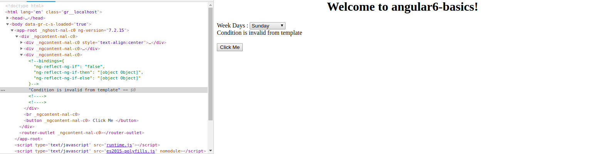
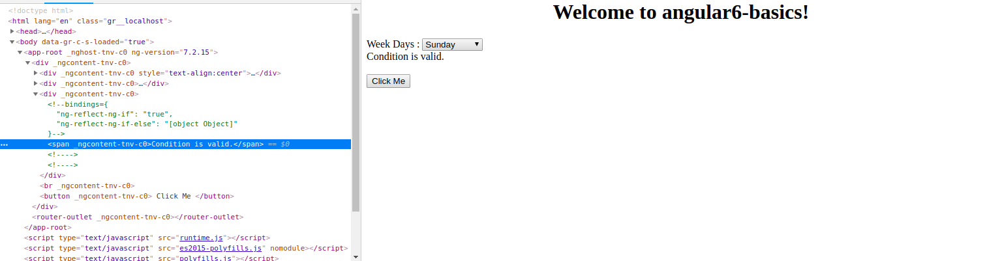

# Angular 6 Templates
It uses the **<ng-template>** , which is similar to the Angular pervious verisons 2 and 4. The reasong of changing from *<template>* to *<ng-template>* is, because there is a name conflict between the <template> tag and the *html <template>* standard tag.
We will see the example of template along with the *if else condition* and see the output.
In *app.component.html* write the following code insdie the div element.
```
<div>
    <span *ngIf = "isavailable;then condition1 else condition2">Condition is valid.</span>
    <ng-template #condition1>Condition is valid from template</ng-template>
    <ng-template #condition2>Condition is invalid from template</ng-template>
</div>
```
The templates are to be called as follows −
*If the condition is true, then the condition1 template is called, otherwise condition2.*
Now let's modify the changes in *app.component.ts* file, just add a variable *validationStatus* with the false as the value.
```
  validationStatus = false;
```
The output in your browser will be something similar to the below image:-

The variable *validationStatus* is set to false that is why the condition2 template is printed.
**Note**: If you inspect the browser you will see that you never get the span tag in the dom. The following image will help you understand this.

If you wanna have the span tag on your browser , you just have to do the following changes in your *app.component.html* 
```
<div>
   <span *ngIf = "validationStatus; else condition2">Condition is valid.</span> // Here you will observe we have removed the then condition1
   <ng-template #condition1>Condition is valid from template</ng-template>
   <ng-template #condition2>Condition is invalid from template</ng-template>
</div>
```
And also change the value of *validationStatus* from *false* to *true*. Now if you will the content of browser you will see the text *condition is valid* and while inspecting you will find that you have the span tag on your browser just like the below example.

<div>	
  <span><a href ="https://github.com/satish-dev/angular-basics/blob/master/documentation/EventBinding.md" >Previous (Event Binding)</a></span>
	&nbsp;&nbsp;&nbsp;&nbsp;&nbsp;&nbsp;&nbsp;&nbsp;&nbsp;&nbsp;&nbsp;&nbsp;&nbsp;
	&nbsp;&nbsp;&nbsp;&nbsp;&nbsp;&nbsp;&nbsp;&nbsp;&nbsp;&nbsp;&nbsp;&nbsp;&nbsp;
	&nbsp;&nbsp;&nbsp;&nbsp;&nbsp;&nbsp;&nbsp;&nbsp;&nbsp;&nbsp;&nbsp;&nbsp;&nbsp;
	&nbsp;&nbsp;&nbsp;&nbsp;&nbsp;&nbsp;&nbsp;&nbsp;&nbsp;&nbsp;&nbsp;&nbsp;&nbsp;
    &nbsp;&nbsp;&nbsp;&nbsp;&nbsp;&nbsp;&nbsp;&nbsp;&nbsp;&nbsp;&nbsp;&nbsp;&nbsp;
	&nbsp;&nbsp;&nbsp;&nbsp;&nbsp;&nbsp;&nbsp;&nbsp;&nbsp;&nbsp;&nbsp;&nbsp;&nbsp;
	&nbsp;&nbsp;&nbsp;&nbsp;&nbsp;&nbsp;&nbsp;&nbsp;&nbsp;&nbsp;&nbsp;&nbsp;&nbsp;
	&nbsp;&nbsp;
	<span><a href ="https://github.com/satish-dev/angular-basics/blob/master/documentation/Directives.md" >Next (Angular Directives</a> </span>
</div>